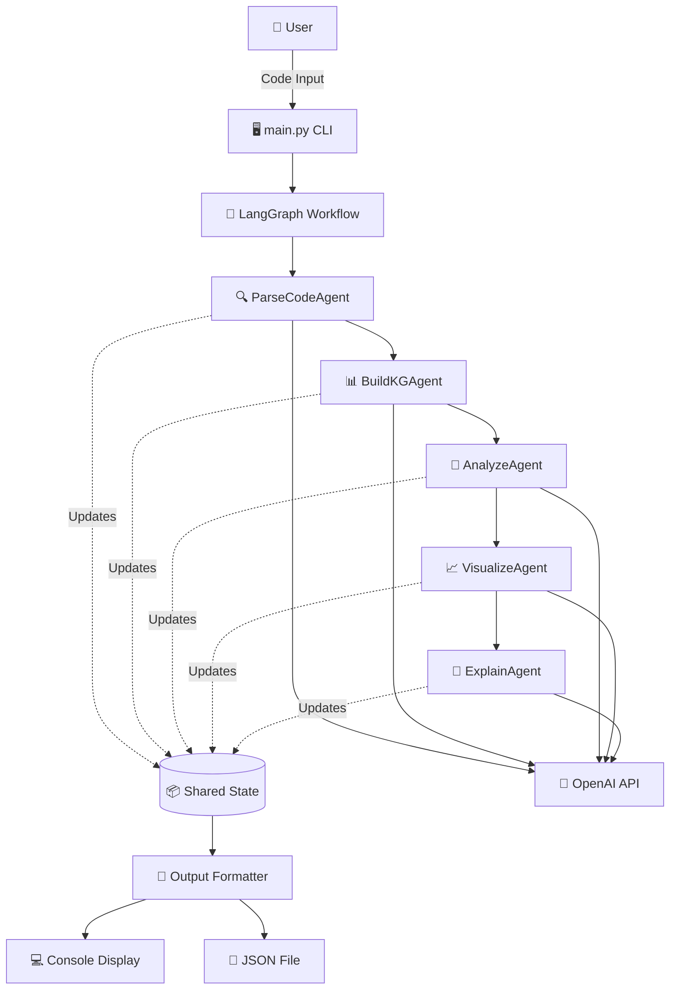
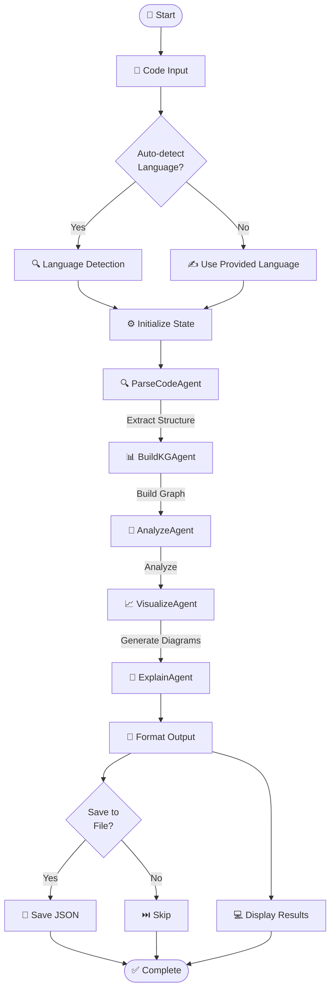
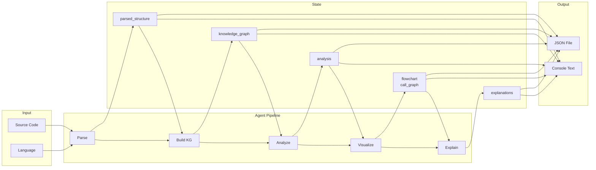
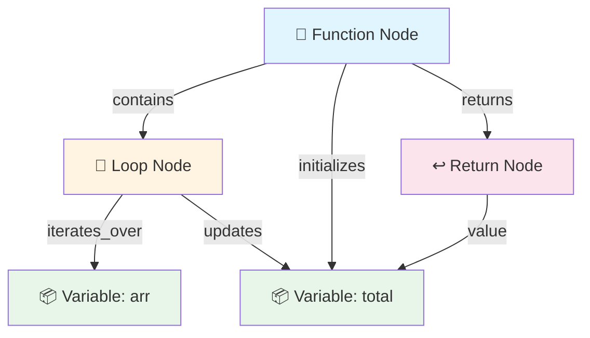
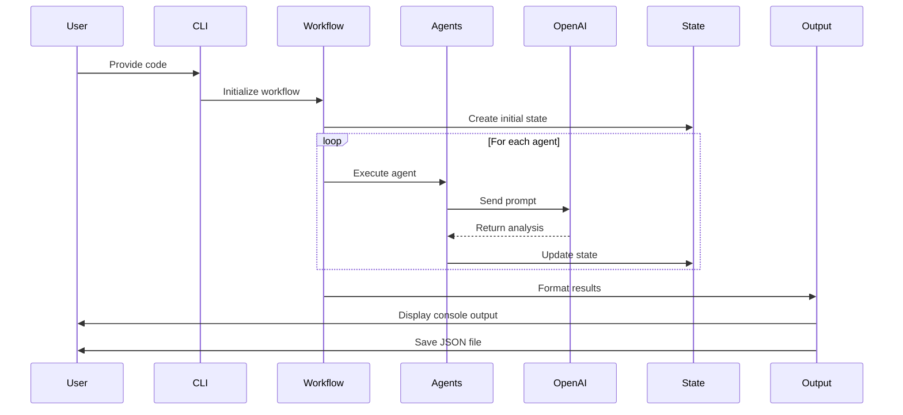
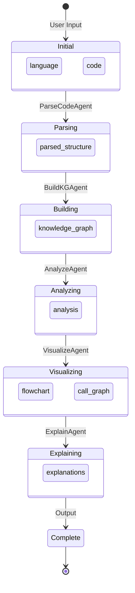
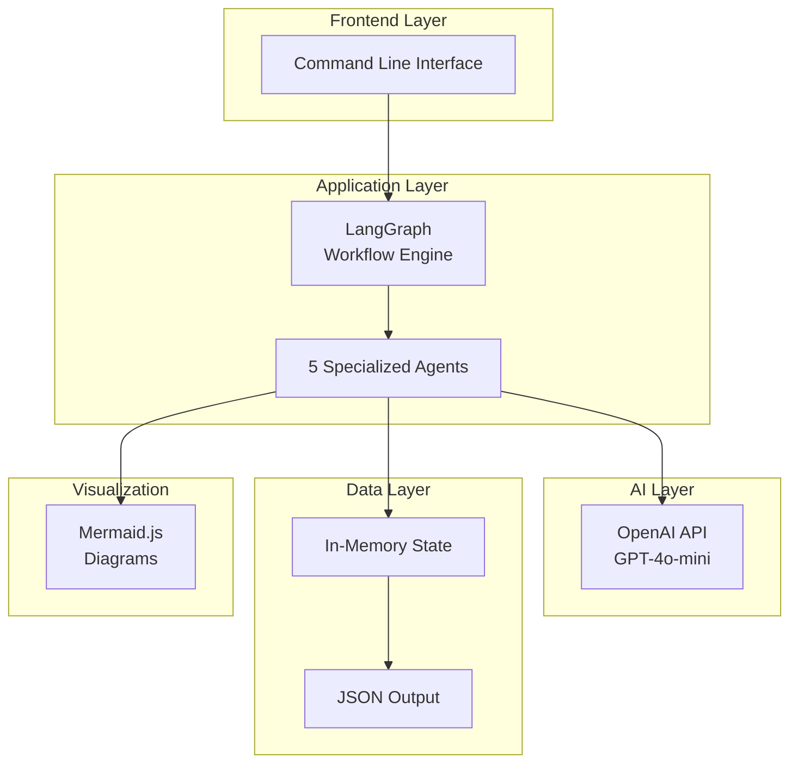
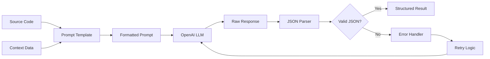
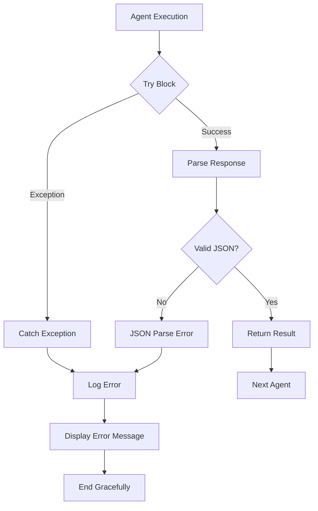

# System Architecture

## High-Level Architecture Diagram



## Agent Flow Diagram



## Data Flow Diagram



## Knowledge Graph Structure



## Component Interaction



## State Transition Diagram



## Directory Structure

```
langgraph-code-inspector/
│
├── 📁 agents/              # Agent implementations
│   ├── parse_agent.py      # Extract code structure
│   ├── kg_agent.py         # Build knowledge graph
│   ├── analyze_agent.py    # Analyze code quality
│   ├── visualize_agent.py  # Generate diagrams
│   └── explain_agent.py    # Create explanations
│
├── 📁 graph/               # LangGraph workflow
│   └── workflow.py         # Workflow orchestration
│
├── 📁 core/                # Core utilities
│   ├── state.py            # State definition
│   ├── prompts.py          # LLM prompts
│   └── utils.py            # Helper functions
│
├── 📁 data/                # Data and samples
│   ├── samples.py          # Sample code snippets
│   └── samples.json        # Generated samples
│
├── 📁 outputs/             # Generated analyses
│   └── analysis_*.json     # Timestamped results
│
├── 📄 main.py              # CLI entry point
├── 📄 demo.py              # Demo script
├── 📄 requirements.txt     # Dependencies
├── 📄 .env                 # API configuration
├── 📄 README.md            # Main documentation
├── 📄 QUICKSTART.md        # Quick start guide
└── 📄 DOCUMENTATION.md     # Detailed docs
```

## Technology Stack



## Prompt Engineering Flow



## Error Handling Strategy



---

*These diagrams provide a visual representation of the system architecture and can be rendered using Mermaid.js in any compatible viewer.*
