# System Architecture

## High-Level Architecture Diagram

```mermaid
graph TB
    User[👤 User] -->|Code Input| CLI[🖥️ main.py CLI]
    CLI --> Workflow[🔄 LangGraph Workflow]
    
    Workflow --> Parse[🔍 ParseCodeAgent]
    Parse --> KG[📊 BuildKGAgent]
    KG --> Analyze[🔬 AnalyzeAgent]
    Analyze --> Visualize[📈 VisualizeAgent]
    Visualize --> Explain[📝 ExplainAgent]
    
    Parse -.->|Updates| State[(📦 Shared State)]
    KG -.->|Updates| State
    Analyze -.->|Updates| State
    Visualize -.->|Updates| State
    Explain -.->|Updates| State
    
    State --> Output[📄 Output Formatter]
    Output --> Console[💻 Console Display]
    Output --> JSON[💾 JSON File]
    
    Parse --> OpenAI[🤖 OpenAI API]
    KG --> OpenAI
    Analyze --> OpenAI
    Visualize --> OpenAI
    Explain --> OpenAI
```



## Agent Flow Diagram

```mermaid
flowchart TD
    Start([🚀 Start]) --> Input[📝 Code Input]
    Input --> Detect{Auto-detect<br/>Language?}
    Detect -->|Yes| Auto[🔍 Language Detection]
    Detect -->|No| Manual[✍️ Use Provided Language]
    Auto --> Init[⚙️ Initialize State]
    Manual --> Init
    
    Init --> Agent1[🔍 ParseCodeAgent]
    Agent1 -->|Extract Structure| Agent2[📊 BuildKGAgent]
    Agent2 -->|Build Graph| Agent3[🔬 AnalyzeAgent]
    Agent3 -->|Analyze| Agent4[📈 VisualizeAgent]
    Agent4 -->|Generate Diagrams| Agent5[📝 ExplainAgent]
    
    Agent5 --> Format[🎨 Format Output]
    Format --> Display[💻 Display Results]
    Format --> Save{Save to<br/>File?}
    Save -->|Yes| File[💾 Save JSON]
    Save -->|No| Skip[⏭️ Skip]
    
    File --> End([✅ Complete])
    Skip --> End
    Display --> End
```



## Data Flow Diagram


## Knowledge Graph Structure

```mermaid
graph TD
    Function[🔧 Function Node] -->|contains| Loop[🔁 Loop Node]
    Function -->|initializes| Var1[📦 Variable: total]
    Loop -->|iterates_over| Var2[📦 Variable: arr]
    Loop -->|updates| Var1
    Function -->|returns| Return[↩️ Return Node]
    Return -->|value| Var1
    
    style Function fill:#e1f5ff
    style Loop fill:#fff4e1
    style Var1 fill:#e8f5e9
    style Var2 fill:#e8f5e9
    style Return fill:#fce4ec
```



## Component Interaction


## State Transition Diagram


## Complete Agentic Workflow: End-to-End Journey

### 🎬 The Full Pipeline (Step-by-Step)

```mermaid
graph TB
    Input[📥 User Input: Code Snippet] --> Entry[🚀 Entry Point: main.py or app.py]
    
    Entry --> Init[⚙️ Initialize LangGraph Workflow]
    Init --> State0[📦 Create Initial State<br/>language: 'python'<br/>code: '...'<br/>parsed_structure: None<br/>knowledge_graph: None<br/>analysis: None<br/>diagrams: None<br/>explanations: None]
    
    State0 --> Agent1[🔍 Agent 1: ParseCodeAgent]
    Agent1 --> Parse1[Extract AST Structure]
    Parse1 --> Parse2[Identify Functions/Classes]
    Parse2 --> Parse3[Find Loops & Conditions]
    Parse3 --> Parse4[List Variables & Calls]
    Parse4 --> State1[📦 State Update 1<br/>parsed_structure: &#123;functions, loops, conditions&#125;]
    
    State1 --> Agent2[📊 Agent 2: BuildKGAgent]
    Agent2 --> KG1[Read parsed_structure from State]
    KG1 --> KG2[🤖 LLM: Convert to Graph<br/>Prompt: Create nodes & edges]
    KG2 --> KG3[Parse JSON Response]
    KG3 --> KG4[Validate Graph Structure]
    KG4 --> State2[📦 State Update 2<br/>knowledge_graph: &#123;nodes, edges&#125;]
    
    State2 --> Agent3[🔬 Agent 3: AnalyzeAgent]
    Agent3 --> Ana1[Read knowledge_graph from State]
    Ana1 --> Ana2[🤖 LLM: Analyze Code Quality<br/>Prompt: Find bugs, edge cases, complexity]
    Ana2 --> Ana3[Trace Variable Flows via KG]
    Ana3 --> Ana4[Detect Anti-patterns via KG]
    Ana4 --> State3[📦 State Update 3<br/>analysis: &#123;bugs, suggestions, complexity&#125;]
    
    State3 --> Agent4[📈 Agent 4: VisualizeAgent]
    Agent4 --> Viz1[Read KG + Analysis from State]
    Viz1 --> Viz2[🤖 LLM: Generate Flowchart Steps<br/>Prompt: Create step-by-step flowchart]
    Viz2 --> Viz3[🎨 Render Flowchart with Matplotlib<br/>BFS Layout + Collision-Free Arrows]
    Viz3 --> Viz4[🤖 LLM: Generate Call Graph]
    Viz4 --> Viz5[🎨 Render Call Graph with NetworkX]
    Viz5 --> State4[📦 State Update 4<br/>diagrams: &#123;flowchart_png, callgraph_png&#125;]
    
    State4 --> Agent5[📝 Agent 5: ExplainAgent]
    Agent5 --> Exp1[Read ALL State Data]
    Exp1 --> Exp2[🤖 LLM: Line-by-Line Explanation<br/>Prompt: Explain each line in context]
    Exp2 --> Exp3[🤖 LLM: High-Level Summary<br/>Prompt: Algorithm overview]
    Exp3 --> Exp4[🤖 LLM: Beginner/Expert Views<br/>Prompt: Multi-level explanations]
    Exp4 --> State5[📦 State Update 5<br/>explanations: &#123;line_by_line, summary, levels&#125;]
    
    State5 --> Output[🎨 Format Final Output]
    Output --> Display1[💻 Console Display]
    Output --> Display2[💾 JSON File Export]
    Output --> Display3[🌐 Gradio Web UI]
    
    Display1 --> End([✅ Complete])
    Display2 --> End
    Display3 --> End
```



### 📖 Detailed Walkthrough

#### **Phase 1: Code Ingestion & Parsing** (Agent 1)

**What Happens:**
1. User provides code snippet (Python, JavaScript, etc.)
2. `ParseCodeAgent` receives code as raw text
3. Uses Python AST (or tree-sitter for JS) to extract:
   - Function/class definitions
   - Loop structures (for, while)
   - Conditional branches (if, else, switch)
   - Variable declarations
   - Function calls
   - Return statements

**Example:**
```python
# Input Code
def find_max(arr):
    max_val = arr[0]
    for num in arr:
        if num > max_val:
            max_val = num
    return max_val

# Parsed Structure (Output)
{
  "functions": [{"name": "find_max", "params": ["arr"], "line": 1}],
  "loops": [{"type": "for", "iterator": "num", "iterable": "arr", "line": 3}],
  "conditions": [{"condition": "num > max_val", "line": 4}],
  "variables": ["max_val", "num"],
  "returns": [{"value": "max_val", "line": 6}]
}
```

**State After Phase 1:**
```python
{
  "language": "python",
  "code": "def find_max(arr): ...",
  "parsed_structure": {...}  # ✅ Updated
}
```

---

#### **Phase 2: Knowledge Graph Construction** (Agent 2)

**What Happens:**
1. `BuildKGAgent` reads `parsed_structure` from shared state
2. Sends structured prompt to GPT-4o-mini:
   ```
   "You are a KG expert. Convert this parsed structure into nodes & edges.
    Node types: function, loop, condition, variable, call, return
    Edge types: contains, calls, updates, initializes, leads_to"
   ```
3. LLM analyzes semantic relationships:
   - `find_max` **contains** loop
   - Loop **contains** condition
   - `max_val` **initializes** from `arr[0]`
   - Condition **leads_to** update of `max_val`
4. Returns JSON graph structure
5. Agent validates and stores in state

**Example KG:**
```json
{
  "nodes": [
    {"id": "f_find_max", "type": "function", "label": "find_max"},
    {"id": "loop_1", "type": "loop", "label": "for num in arr"},
    {"id": "cond_1", "type": "condition", "label": "num > max_val"},
    {"id": "var_max_val", "type": "variable", "label": "max_val"},
    {"id": "ret_1", "type": "return", "label": "return max_val"}
  ],
  "edges": [
    {"source": "f_find_max", "target": "loop_1", "relation": "contains"},
    {"source": "loop_1", "target": "cond_1", "relation": "contains"},
    {"source": "cond_1", "target": "var_max_val", "relation": "updates"}
  ]
}
```

**Why This Matters:**
- KG captures **semantic relationships**, not just syntax
- Enables graph traversal algorithms to find bugs
- Provides context for later agents

**State After Phase 2:**
```python
{
  "parsed_structure": {...},
  "knowledge_graph": {"nodes": [...], "edges": [...]}  # ✅ Updated
}
```

---

#### **Phase 3: Intelligent Code Analysis** (Agent 3)

**What Happens:**
1. `AnalyzeAgent` reads both `parsed_structure` AND `knowledge_graph`
2. Sends enriched prompt to LLM:
   ```
   "Analyze this code using the knowledge graph.
    Find: bugs, edge cases, complexity, anti-patterns
    Use KG to trace variable flows and execution paths"
   ```
3. **LLM uses KG to:**
   - **Trace variable lifetime:** Follow `initializes` → `updates` edges
   - **Find uninitialized vars:** Check if all paths initialize variables
   - **Detect complexity:** Count nested `contains` edges (loops in loops)
   - **Identify edge cases:** Analyze condition nodes for missing branches
   - **Spot anti-patterns:** Look for inefficient relationship patterns

**Example Analysis:**
```json
{
  "bugs": [
    "IndexError possible if arr is empty (max_val = arr[0])"
  ],
  "edge_cases": [
    "Empty array input",
    "Single element array",
    "All negative numbers"
  ],
  "complexity": {
    "time": "O(n) - single loop through array",
    "space": "O(1) - constant space"
  },
  "suggestions": [
    "Add guard clause: if not arr: return None",
    "Consider using max() built-in for simplicity"
  ],
  "anti_patterns": []
}
```

**How KG Enables This:**
- Without KG: LLM might miss that `max_val` depends on `arr[0]`
- With KG: Edge `var_max_val` ← `initializes` ← `arr[0]` makes dependency explicit
- KG traversal reveals: "No edge case handling before array access"

**State After Phase 3:**
```python
{
  "knowledge_graph": {...},
  "analysis": {"bugs": [...], "suggestions": [...]}  # ✅ Updated
}
```

---

#### **Phase 4: Visual Diagram Generation** (Agent 4)

**What Happens:**
1. `VisualizeAgent` reads `code`, `knowledge_graph`, and `analysis`

**Sub-Step 4A: Flowchart Generation**
2. Sends prompt to LLM:
   ```
   "Create step-by-step flowchart description.
    Use KG nodes to identify: start, process, decision, return, end steps
    Define flow connections (next, yes, no)"
   ```
3. **LLM uses KG to create logical flow:**
   ```json
   {
     "steps": [
       {"id": "start", "type": "start", "label": "Start", "next": "step1"},
       {"id": "step1", "type": "process", "label": "Initialize max_val = arr[0]", "next": "step2"},
       {"id": "step2", "type": "loop", "label": "For each num in arr", "yes": "step3", "no": "step5"},
       {"id": "step3", "type": "decision", "label": "Is num > max_val?", "yes": "step4", "no": "step2"},
       {"id": "step4", "type": "process", "label": "Update max_val = num", "next": "step2"},
       {"id": "step5", "type": "return", "label": "Return max_val", "next": "end"},
       {"id": "end", "type": "end", "label": "End"}
     ]
   }
   ```
4. **Smart Diagram Renderer:**
   - Uses BFS to layout nodes (8 units horizontal, 4.5 vertical spacing)
   - Draws boxes: rectangles for process, diamonds for decisions, ovals for start/end
   - Routes arrows with collision avoidance (8.3+ unit clearances)
   - Adds proper arrowheads using matplotlib annotations
5. Saves PNG to `temp/flowchart.png`

**Sub-Step 4B: Call Graph Generation**
6. Uses KG `call` edges to map function relationships
7. Renders with NetworkX + Matplotlib
8. Saves PNG to `temp/callgraph.png`

**State After Phase 4:**
```python
{
  "analysis": {...},
  "diagrams": {
    "flowchart": "temp/flowchart.png",
    "callgraph": "temp/callgraph.png"
  }  # ✅ Updated
}
```

---

#### **Phase 5: Multi-Level Explanations** (Agent 5)

**What Happens:**
1. `ExplainAgent` reads **ENTIRE STATE** (all previous results)
2. Generates 4 types of explanations:

**A. Line-by-Line Explanation**
```
Prompt: "Explain each line using KG context and analysis"
LLM Output:
- Line 1: "Function 'find_max' takes array parameter"
- Line 2: "Initialize max_val with first element (⚠️ Edge case: empty array)"
- Line 3: "Loop through each number in array"
- Line 4: "Check if current number is larger than max_val"
- Line 5: "Update max_val if condition is true"
- Line 6: "Return the maximum value found"
```

**B. High-Level Summary**
```
Prompt: "Summarize algorithm using complexity from analysis"
LLM Output:
"Linear search algorithm to find maximum value in array.
 Time: O(n), Space: O(1). Single pass through array comparing elements."
```

**C. Beginner Explanation**
```
Prompt: "Explain for beginners"
LLM Output:
"This function finds the biggest number in a list. It starts by assuming
 the first number is the biggest, then checks each number one by one.
 If it finds a bigger number, it remembers that one instead."
```

**D. Expert Explanation**
```
Prompt: "Technical deep-dive"
LLM Output:
"Implements greedy max-finding with single-pass iteration. Maintains
 running maximum via in-place comparison. Optimal time complexity O(n)
 as all elements must be examined. No early termination possible.
 Note: Lacks input validation (empty array causes IndexError)."
```

**State After Phase 5:**
```python
{
  "diagrams": {...},
  "explanations": {
    "line_by_line": [...],
    "summary": "...",
    "beginner": "...",
    "expert": "..."
  }  # ✅ Updated
}
```

---

#### **Phase 6: Output Formatting & Delivery**

**What Happens:**
1. All agents complete, final state contains everything
2. Output formatter creates:
   - **Console Display:** Formatted text with emojis and colors
   - **JSON Export:** Complete analysis saved to `outputs/analysis_*.json`
   - **Web UI (Gradio):** Interactive tabs showing all results
3. User receives:
   - ✅ Code structure breakdown
   - ✅ Knowledge graph visualization (node/edge counts)
   - ✅ Bug reports and suggestions
   - ✅ Complexity metrics
   - ✅ Flowchart PNG image
   - ✅ Call graph PNG image
   - ✅ Multi-level explanations

---

### 🔄 Key Insights: How Agents Collaborate


**Synergy Examples:**

1. **Parse → KG → Analyze:**
   - Parse finds: `max_val = arr[0]`
   - KG creates: `var_max_val` ← `initializes` ← `arr[0]`
   - Analyze traces: "No guard clause before array access" → **Bug detected!**

2. **KG → Visualize:**
   - KG shows: `loop_1` contains `cond_1`
   - Visualize creates: Diamond (decision) inside loop box
   - Result: Accurate flowchart structure

3. **Analyze → Explain:**
   - Analyze finds: "O(n) complexity, IndexError risk"
   - Explain incorporates: "⚠️ Edge case warning" in line-by-line
   - Result: Context-aware explanations

---

### 🎯 Why This Multi-Agent Approach Works

| Traditional Approach | Multi-Agent Approach |
|---------------------|---------------------|
| Single prompt → One answer | 5 specialized agents → Deep analysis |
| Limited context window | Incremental state building |
| Generic insights | Domain-specific expertise per agent |
| Text-only output | Text + Graphs + Diagrams |
| Shallow analysis | KG-powered semantic understanding |

**The Power of State Sharing:**
Each agent builds on previous work, creating a **compound intelligence effect** where the whole is greater than the sum of parts.

---

## Directory Structure

```
langgraph-code-inspector/
│
├── 📁 agents/              # Agent implementations
│   ├── parse_agent.py      # Extract code structure
│   ├── kg_agent.py         # Build knowledge graph
│   ├── analyze_agent.py    # Analyze code quality
│   ├── visualize_agent.py  # Generate diagrams
│   └── explain_agent.py    # Create explanations
│
├── 📁 graph/               # LangGraph workflow
│   └── workflow.py         # Workflow orchestration
│
├── 📁 core/                # Core utilities
│   ├── state.py            # State definition
│   ├── prompts.py          # LLM prompts
│   └── utils.py            # Helper functions
│
├── 📁 data/                # Data and samples
│   ├── samples.py          # Sample code snippets
│   └── samples.json        # Generated samples
│
├── 📁 outputs/             # Generated analyses
│   └── analysis_*.json     # Timestamped results
│
├── 📄 main.py              # CLI entry point
├── 📄 demo.py              # Demo script
├── 📄 requirements.txt     # Dependencies
├── 📄 .env                 # API configuration
├── 📄 README.md            # Main documentation
├── 📄 QUICKSTART.md        # Quick start guide
└── 📄 DOCUMENTATION.md     # Detailed docs
```

## Technology Stack


## Prompt Engineering Flow


## Error Handling Strategy


---

*These diagrams provide a visual representation of the system architecture and can be rendered using Mermaid.js in any compatible viewer.*
