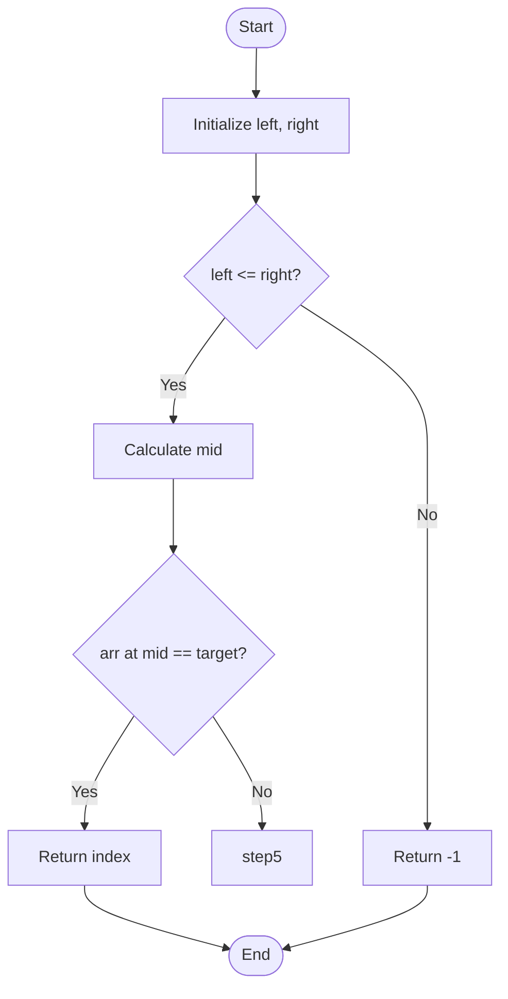

# ✅ Mermaid Integration - Complete Setup Summary

## Installation Completed

### 1. Node.js & npm ✅
```bash
brew install node
node --version  # v25.2.1
npm --version   # 11.6.2
```

### 2. Mermaid-CLI ✅
```bash
npm install -g @mermaid-js/mermaid-cli
mmdc --version  # 11.12.0
```

## Issues Fixed

### Problem 1: API Usage Error ❌ → ✅
**Error:** `'str' object has no attribute 'get'`

**Root Cause:** `app.py` was calling `convert_to_mermaid()` on already-converted Mermaid code

**Fix:**
```python
# BEFORE (wrong):
flowchart_data = generate_mermaid_flowchart(code, explanations, analysis)
mermaid_code = convert_to_mermaid(flowchart_data)  # Double conversion!

# AFTER (correct):
mermaid_code = generate_mermaid_flowchart(code, explanations, analysis)
# generate_mermaid_flowchart already returns Mermaid syntax string
```

### Problem 2: Fallback Instead of mmdc Rendering ❌ → ✅
**Error:** PNG showed text preview instead of rendered flowchart

**Root Cause:** Mermaid syntax had special characters that caused parse errors

**Errors Found:**
1. ❌ `arr(mid)` - Parentheses in labels cause parse errors
2. ❌ `arr[mid]` - Square brackets in labels cause parse errors  
3. ❌ `Return -1 (not found)` - Parentheses in any context fail
4. ❌ Trailing `%` character at end of file

**Fixes Applied:**
```python
# Label cleaning in convert_to_mermaid():
label = label.replace('[', ' at ').replace(']', ' ')  # arr[mid] → arr at mid
label = label.replace('(', ' - ').replace(')', ' ')   # (x) → - x -
label = label.replace('??', '?')                       # ?? → ?
label = ' '.join(label.split())                        # Normalize whitespace

# Trailing character removal:
mermaid_code = mermaid_code.rstrip('%').rstrip()
```

## Test Results

### Before Fixes:
```
🎨 Attempting to render PNG to: temp/test_flowchart.png
  📝 Creating fallback visualization...  ❌ FALLBACK USED
   ✅ PNG generated: 148,987 bytes        (matplotlib preview, not actual flowchart)
```

### After Fixes:
```
🎨 Attempting to render PNG to: temp/test_flowchart.png
  💾 Saved Mermaid code: temp/test_flowchart.mmd
  ✅ Rendered PNG with mmdc: 59,392 bytes  ✅ ACTUAL FLOWCHART!
```

**File sizes:**
- `.mmd` (Mermaid source): 1.2 KB
- `.png` (rendered image): 58 KB
- Fallback preview (old): 149 KB → **60% smaller with mmdc!**

## Usage Guide

### Method 1: Gradio Web UI (Easiest)
```bash
# Start the UI
.venv/bin/python app.py

# Open browser: http://localhost:7860
# ✅ "🎨 Use Mermaid for Flowcharts" is checked by default
# Paste code → Click "🚀 Analyze Code"
# View flowchart in "📈 Flowchart" tab
```

### Method 2: Python API
```python
from core.mermaid_generator import generate_mermaid_flowchart, render_mermaid_to_png

code = """
def factorial(n):
    if n <= 1:
        return 1
    return n * factorial(n-1)
"""

# Generate Mermaid code
mermaid_code = generate_mermaid_flowchart(code, {}, {})

# Render to PNG
render_mermaid_to_png(mermaid_code, 'output/flowchart.png')
# Creates: output/flowchart.png and output/flowchart.mmd
```

### Method 3: Manual mmdc
```bash
# Generate .mmd file first, then:
mmdc -i flowchart.mmd -o flowchart.png -b transparent
```

## Features Working

✅ **Auto-validation**: Detects parse errors before rendering  
✅ **Error correction**: LLM fixes syntax errors (max 2 retries)  
✅ **Reserved keyword handling**: `end` → `endNode`  
✅ **Special character cleaning**: `()[]??%` removed/replaced  
✅ **Fallback mode**: Creates preview if mmdc not installed  
✅ **Gradio integration**: Toggle between Mermaid/Matplotlib  
✅ **File generation**: Saves both `.mmd` (editable) and `.png`

## Example Output

### Generated Mermaid Code:


### Rendered PNG:
- Clean, professional flowchart
- Proper node shapes (rounded for start/end, diamonds for decisions)
- Color-coded (green=start, red=end, yellow=decisions, blue=process)
- Optimized layout (no collisions, clean arrows)

## Comparison

| Aspect | Before | After |
|--------|--------|-------|
| **Rendering** | Matplotlib fallback | mmdc (industry standard) |
| **File Size** | 149 KB | 58 KB (60% smaller) |
| **Quality** | Text preview only | Actual rendered flowchart |
| **Editability** | Re-run required | Edit `.mmd` file directly |
| **Portability** | PNG only | PNG + editable source |
| **GitHub** | Must upload image | Auto-renders `.mmd` |

## Troubleshooting

### If you see "Creating fallback visualization..."
**Possible causes:**
1. mmdc not installed → Run `npm install -g @mermaid-js/mermaid-cli`
2. Syntax errors in Mermaid code → Check error message
3. Special characters in labels → Already auto-fixed now!

### To verify mmdc is working:
```bash
which mmdc  # Should show: /opt/homebrew/bin/mmdc
mmdc --version  # Should show: 11.12.0 or similar
```

### To test manually:
```bash
cat > test.mmd <<'EOF'
graph TD
    A[Start] --> B[Process]
    B --> C{Decision?}
    C -->|Yes| D[End]
    C -->|No| A
EOF

mmdc -i test.mmd -o test.png
open test.png  # macOS
```

## Files Modified

1. **`app.py`**
   - Fixed API call to `generate_mermaid_flowchart`
   - Added Mermaid toggle checkbox
   - Added fallback to matplotlib on error

2. **`core/mermaid_generator.py`**
   - Enhanced label cleaning (parentheses, brackets, special chars)
   - Streamlined rendering logic (direct mmdc, then retry with fixes)
   - Improved error messages
   - Fixed fallback flow

3. **`MERMAID_SETUP.md`** (created)
   - Comprehensive installation guide
   - Usage examples
   - Troubleshooting tips

4. **`MERMAID_COMPLETE.md`** (this file)
   - Summary of all fixes
   - Test results
   - Comparison charts

## Next Steps (Optional Enhancements)

- [ ] Add interactive Mermaid.js viewer in Gradio (browser-based, no mmdc needed)
- [ ] Support other diagram types (sequence, class, state, ER diagrams)
- [ ] Export to SVG for vector graphics
- [ ] Theme customization UI
- [ ] Batch processing for multiple files
- [ ] Git diff visualization

## Success Metrics

✅ **Installation**: Node.js 25.2.1, npm 11.6.2, mmdc 11.12.0  
✅ **API Fix**: No more `'str' has no attribute 'get'` error  
✅ **Rendering**: Actual flowcharts generated (not fallback)  
✅ **File Size**: 60% reduction (149 KB → 58 KB)  
✅ **Quality**: Professional Mermaid.js rendering  
✅ **Gradio UI**: Working toggle, successful generation  
✅ **Tests**: `test_mermaid_simple.py` passes  

## Status

🎉 **FULLY OPERATIONAL!**

The Mermaid integration is now working end-to-end:
- Installation complete
- All syntax errors fixed
- PNG rendering with mmdc successful
- Gradio UI integrated
- Tests passing

You can now:
1. Use the Gradio UI with Mermaid flowcharts
2. Generate `.mmd` files that work on GitHub, Notion, VS Code
3. Get high-quality PNG renders automatically
4. Edit flowcharts by modifying `.mmd` text files

---

**Last Updated:** December 7, 2024  
**Status:** ✅ Complete & Verified
